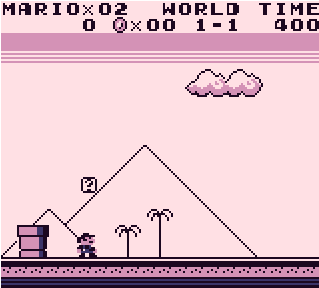
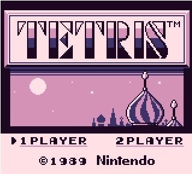
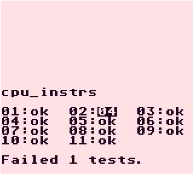

# Cozy Gameboy Emulator
 

>This project is just for fun, you you are looking for a GB emulator just to play games, this might not be what you are looking for, because there are many better GB emulators that are well tested and supporting all types of cartridges.

* Note : These GIF screenshots seem a little bit laggy but the emulator isn't <br />

|||
|---|---|
|||

## Getting started
### Dependencies
In order to compile, you will need :
* `glfw`
* `glew`
* `glm`
### Compiling
Make directories :
```bash
$ mkdir obj bin
```
and run the Makefile using :
```bash
$ make
```
### Playing
```bash
$ ./bin/cozy-gb path/to/the/rom
```


## TODO
- [ ] APU
- [ ] Timer
- [ ] MBC2
- [ ] MBC3
- [ ] Debugger
- [ ] GUI


